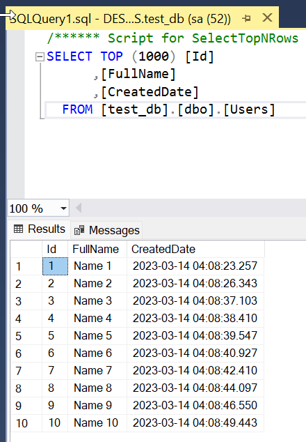

DBLOG.DatabaseLogAnalyzer can read the SQL Server transaction logs online and generate RedoSQL and UndoSQL for every transaction. 
- It base on SQL Server fn_dblog() function and develop some extension.
- This repository is forked from https://github.com/ap0405140/MSSQLLogAnalyzer and added some features
   - Upgrade to .NET 6
   - Add Integration Testing project

## Tests project
Built with `Specflow` and `Testcontainers` which helps the test cases are run on real databases
- The original database is placed in `DatabaseSources\test_db.mdf`
- It can be attached by using the `Attach` feature. Link https://learn.microsoft.com/en-us/sql/relational-databases/databases/attach-a-database?view=sql-server-ver16
Connect to SQL Server, create a test table dbo.OrderDetail, and run some DML sql on this table.



### Test cases
They can be found in here:
[LivingDoc.html](LivingDoc.html)

#### To regenerate the living documentation
```
livingdoc test-assembly Tests.dll -t TestExecution.json
```

## Notes
- For actual logics to generate the `Redo` and `Undo`, please contact directly the author `ap0405140@163.com` or https://github.com/ap0405140/MSSQLLogAnalyzer
